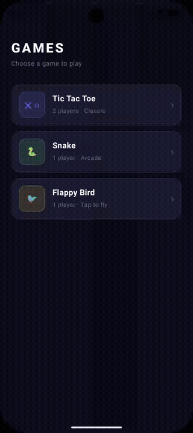

# 🎮 Jetpack Compose Games

A collection of classic arcade games built entirely with **Jetpack Compose** — no game engines, no third-party libraries. Pure Kotlin, pure Canvas, pure fun.

<p align="center">
  
  
  
  
</p>

---

## 📱 Games

### 🔲 Tic Tac Toe

> Two players take turns — first to align three symbols wins.

| Gameplay |
|:---:|
| <video src="assets/tic-tac-toe.webm" width="320" autoplay loop muted playsinline></video> |

**Features**
- Canvas-drawn X and O symbols with bounce-in animation on placement
- Live score tracking for X, O, and draws — persists across rounds
- Winning cells highlighted; board auto-resets 2 seconds after game ends
- Dark theme with accent colors per player

---

### 🐍 Snake

> Eat food, grow longer — don't hit the walls or yourself.

| Gameplay |
|:---:|
| *<!-- Replace this line with:  -->* |
| `📸 Add your GIF here — see Recording Guide below` |

**Features**
- Smooth 20×20 grid with a 60 fps coroutine game loop
- D-pad controls with reverse-direction guard
- Randomised food spawning on empty cells only
- Score + high score header; high score persists for the session

---

### 🐦 Flappy Bird

> Tap to flap, survive the pipes, beat your high score.

| Gameplay |
|:---:|
| *<!-- Replace this line with:  -->* |
| `📸 Add your GIF here — see Recording Guide below` |

**Features**
- Realistic gravity + velocity physics with terminal fall speed
- Infinite procedural pipe generation with randomised gap positions
- Tap anywhere on the game canvas to flap
- Live score overlay during play; GAME OVER screen with PLAY AGAIN
- Canvas-drawn bird with body, eye, and beak; pipes with caps; sky gradient + ground

---

## 🏠 Home Screen

A game-list home screen greets you on launch. Tap any card to slide into that game.

| Home Screen |
|:---:|
| *<!-- Replace this line with:  -->* |
| `📸 Add your screenshot here` |

---

## 🛠️ Tech Stack

| Layer | Technology |
|---|---|
| UI | Jetpack Compose + Canvas API |
| State | `mutableStateOf` / `mutableIntStateOf` in ViewModel |
| Game loop | `viewModelScope` coroutine + `delay()` |
| Navigation | Navigation Compose 2.9.0 (type-safe `@Serializable` routes) |
| Animations | `Animatable` on cells, slide transitions on navigation |
| Language | Kotlin 2.3.21 |
| Min SDK | API 24 (Android 7.0) |

---

## 🏗️ Project Structure

```
features/
├── games_list/         # Home screen — game picker
├── tic_tac_toe/
│   ├── utils/          # GameState, Player, helpers
│   ├── ui/viewmodel/   # TicTacToeViewModel
│   ├── ui/components/  # Board, Cell, ScoreBoard, BackButton …
│   └── ui/screen/      # TicTacToeScreen
├── snake/
│   ├── utils/          # SnakeGameState, SnakePosition, Direction
│   ├── ui/viewmodel/   # SnakeViewModel
│   ├── ui/components/  # SnakeBoard, DirectionControls, ScoreHeader
│   └── ui/screen/      # SnakeScreen
└── flappy_bird/
    ├── utils/          # FlappyBirdGameState, FlappyBirdPipe
    ├── ui/viewmodel/   # FlappyBirdViewModel
    ├── ui/components/  # FlappyBirdCanvas
    └── ui/screen/      # FlappyBirdScreen
navigation/
├── Route.kt            # Sealed interface with @Serializable routes
└── AppNavigation.kt    # NavHost + slide transitions
ui/theme/
└── Color.kt            # Centralised color palette
```

---

## 🚀 Getting Started

1. Clone the repo
   ```bash
   git clone https://github.com/nameisjayant/Jetpack-compose-games.git
   ```
2. Open in **Android Studio Meerkat** or later
3. Run on any device or emulator with **API 24+**

---

## 📸 Recording Guide

To add GIFs to this README:

**Option A — Android Studio Emulator**
1. Run the app on the emulator
2. In the emulator toolbar click **Record** → play the game → **Stop**
3. Export as GIF, save to an `assets/` folder in the project root
4. Replace the placeholder lines above with ``

**Option B — ADB + ffmpeg**
```bash
# Record on a connected device
adb shell screenrecord /sdcard/demo.mp4

# Pull to your machine
adb pull /sdcard/demo.mp4

# Convert to GIF (requires ffmpeg)
ffmpeg -i demo.mp4 -vf "fps=15,scale=320:-1" assets/gameplay.gif
```

---

## 👨‍💻 Author

**Jayant Kumar** — [@nameisjayant](https://github.com/nameisjayant)

---

## 📄 License

```
MIT License — feel free to use, modify, and share.
```
